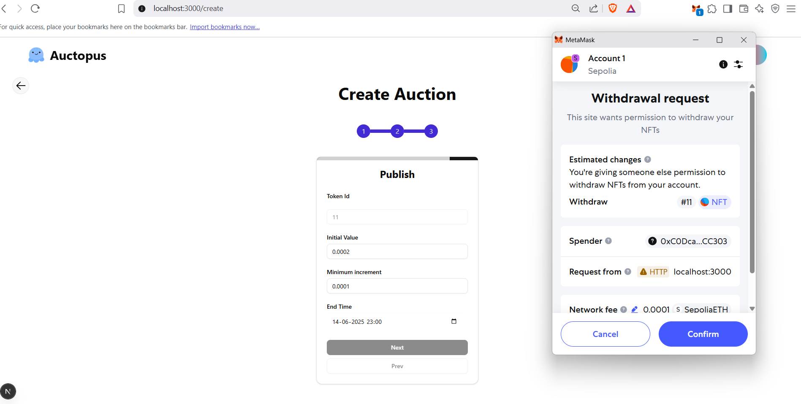

## Auctopus
### Auctopus is a completely decentralized auction platform built on top of sepolia testnet using smart contracts and ERC-721 token

### Token contract is based on OpenZepplin's ERC-721 protocol, read here --> docs(https://docs.openzeppelin.com/contracts/5.x/erc721)
### Have used ethersJS (v6) for Web3 integration
### Both auction contract and nft contracts are available in the repo
### Have used decentralized storage offered by pinata.cloud
### Requires a Metamask wallet
### Have used DaisyUI, ShadCN, and Aceternity for UI, some improvements are still required

## Previews

